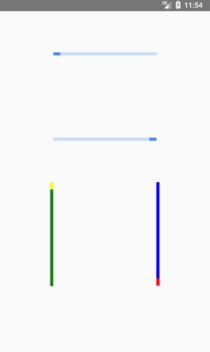

# Progress

React component that indicate that the app is loading or there is some activity in the app.
Support iOS and Android

# Props

* animating
  Whether to show the Progress (true, the default) or hide it (false).
* color
  Color of the progress bar.
* bgcolor
  Background color of the progress bar.
* progress
  The progress value (between 0 and 1).
* inverse
  Whether to inverse the Progress (true) or not (false, the default)
* vertical
  Whether to show a vertical Progress (true) or show a horizontal one (false, the default)
  
# Usage

```javascript
Import Progress from './Progress'

render() {
  return (
    <View style={styles.container}>
           <Progress progress={this.state.progress}/>
        </View>
  )
}
```

# Example




